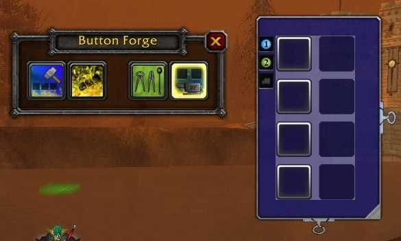

# ButtonForge-classic
Unofficial fork of ButtonForge addon for World of Warcraft classic. 

## Overview
Button Forge is an Action Bar addon that allows you to create completely new Action Bars (as many as you want). Each bar can have up to 1500 buttons organised into rows and columns (up to 5000 buttons total).

Your existing UI wont be changed by Button Forge, it will continue to function and look how it currently does. The bars you create are totally independent allowing you to simply and cleanly add additional action bars to your UI.

The new buttons operate almost identically to the default action buttons (i.e. drag and drop actions as you normally would, etc); there are a few subtle differences though, such as the ability to drop non usable items into the buttons (handy for keeping count of items you're harvesting).

Creation and configuration of the bars is done via the mouse using a GUI interface. This GUI is designed to be straight forward and easy to use, although there is documentation for both basic and advanced configuration options below.

## Features

 *   Create as many bars as you wish (theoretical limit is 5000)
 *   Create as many buttons as you wish (up to 1500 per bar with a total maximum of 5000)
 *   Fully graphical configuration
 *   Key Bindings
 *   Drag and drop actions to buttons (spells, items, macros, companions, equipment sets, Button Forge commands)
 *   Set the scale of the Bars
 *   Control how many rows and columns of buttons are on a bar
 *   Setup visibility macros for your bars so that they can be shown and hidden (even during combat)
 *   Button Facade Support

## How Do I (Basics)

#### Enter into configuration mode
Configuration mode is where you will do things such as create new bars and buttons, position them, etc...
There are several ways, any of the following can be used:

 *   Enter the Button Forge page in Interface->Addons and use the button found there
 *   Create a Key Binding in the Key Bindings menu under the Button Forge section
 *   Drag the Configuration Mode button found on the Button Forge toolbar onto a Button Forge bar, it can then be used to quickly enter and exit configuration mode (recommended)

#### Exit configuration mode
All of the ways to activate config mode will also deactivate it

#### Create a bar
Click the Create Bar button, then click on screen where you want your new bar

#### Destroy a bar
Click the Destroy Bar button, then click on the bar you wish to destroy

#### Add or remove rows and columns of buttons on a bar
Use the Column and Row drag icons on the bar to adjust how many rows and columns of buttons there are

#### Change the scale of a bar
Use the Scale icon on the bar to adjust the size of the buttons

#### Position the bar
Click on the bar background and drag it to the desired location

#### Make the bar only visible for a given talent spec
Use the Spec 1/2 Buttons found on the left side of the bar (a faded icon means it wont be displayed for that talent spec)

#### Make the bar visible when in a vehicle
By default bars are invisible while in a vehicle, use the vehicle button found on the left side of the bar to change this (a faded icon means it wont be displayed while in a vehicle)

## How Do I (Advanced)

#### Enable advanced configuration controls for the bars
Click the advanced tools button on the Button Forge toolbar to toggle the display of the advanced options

#### Set key bindings for the buttons

Click the keyboard icon on the bar to enter Key Bind mode
Click the button you wish to set a binding for
On the binding dialog that has popped up click the key binding button (similar to the standard Key Binding UI)
Press the key binding you want to assign
The dialog can be closed by clicking the x this will close the dialog but leave the bar in Key Bind mode, or press esc to completely #### exit Key Bind mode

Notes: 

 *   Key Bindings in Button Forge are implemented as overrides, this means that any existing bindings wont be removed, but if identical the override will be triggered instead (at least provided the bar is visible on screen)
 *   Button Forge currently wont inform you if the binding already exists on another Button Forge button and it will allow multiple bars to have the same binding, this feature allows some advance ui configurations to be created which will be described further down
 *   If multiple Button Forge bars have the same key binding it will be ambiguous which button will be triggered, however if only one bar is currently visible that is the button that will be triggered
 *   The Button Forge UI for Key Bindings may see some alteration in v1 (I feel the flow of creating bindings is not yet as smooth as it could be)

#### Make a bar only visible while in combat... or out of combat, or while stealthed, cat form, etc...
Any macro conditional in the game can potentially also be used to control if a Button Forge bar is hidden or visible (even during combat)

To setup a visibility macro click the Eye icon and type in the conditional and then press enter (or escape to cancel)... Some basic examples are:

 *   [combat] hide; show
 *   [stealth, harm] show; hide
 *   [form:3] show; hide

Notes:

 *   Visibility macros are more commonly known as visibility state drivers (I just call them visibility macros to draw attention to the fact that you use macro conditionals to control the visibility)
 *   The Spec and Vehicle show/hide options (the ones just above the eye icon) also use the visibility macro to control when the bar is displayed. If you specify a visibility conditional and also have one or more of the Spec/Vehicle options set to hide then _behind the scenes_ the necessary rules will be prepended to your visibility macro for the bar... e.g:
 *       Spec 1 is hidden, and Vehicle is hidden, no visibility macro is set would result in the following state driver: [spec:1] hide; [vehicleui] hide; show
 *       Vehicle hidden, and the combat macro example from above is set would result in the following state driver: [spec:1] hide; [vehicleui] hide; [combat] hide; show
 *       Spec 1/2 both shown, Vehicle shown and no visibility macro set: ...No visibility driver will be set for the bar, and it will always be visible

#### Make the actions on a bar change depending on combat status, or while stealthed, or cat form, etc...
This actually can't be done, but the same effect can be achieved by taking visibility macros a step further.
You can place several bars into the same position on screen and setup visibility macros so that only 1 is displayed at any given time, I will describe the following example to illustrate how to do this.

Lets say you are a druid and want a bar in the center of the screen to have actions for catform and bearform in the same position, and to swap between them depending on your current form:

Create a bar and position it where you want, set it's scale and the number of buttons you want on it
Optionally add a label to it to help identify it easier in the interface (lets make this one the bear bar)
Drag the abilities you want on to it
Set the visibility macro to [bonusbar:3] show; hide
Create another bar place it in the same position as the first one... You might notice that it has docking to make this really easy
Double click the scale button to default the bar to have the same scale as the first bar (double click again will revert back to the standard scale of 1)
Optionally label the bar (for cat form this time)
Drag the abilities you want to it
Set the visibility macro to [bonusbar:1] show; hide
Exit configuration mode and give it a try

If you also wanted to setup key bindings you could do this as well since you can reuse bindings. The buttons in each position on the two bars can have the same binding since only one bar will show up at a time (if at all). Also note that if you want to alternate between which bar you are working on during configuration mode you can use the Send to Front and Send to Back icons so you don't have to move bars out of the way.

#### Make tabs for bars so that it is easier to configure bars located in the same place on screen
Set a label for the bar and position the top left corner of the bar be the same as another bars. Each bar that has a label set will have that label organised from left to right above the bars. Clicking the respective tab (label) will bring that bar to the top.

Note: Even without a tab for the bar you can still bring it to the front or send it to the back by clicking on it's Send To Front and Senf To Back buttons respectively.

#### Create a bonus bar (contains the abilities when you enter a vehicle, possess another unit, or the special abilities given during specific fights)
This can be done using the Create Bonus Bar button. Note that the standard Bonus Bar will continue to function as normal so creating a Button Forge bonus bar is purely optional.

Notes:

 *   The Button Forge bonus bar is a clone of Bonus Bar 5; that is the action bar that receives special actions at certain times during game play (e.g. the actions you can use in a vehicle, or while possessing another unit, etc)
 *   It is possible to create multiple BF bonus bars
 *   The BF Bonus Bar is almost identical to a standard BF Bar except for the following:
  *      It is green in configuration mode
  *      By default standard BF bars will hide when BonusBar 5 is active, whereas by default BF bonus bars will display (handled via the visibility macro)
  *      Several of the default settings for the BF bonus bar are different to the standard BF bars
  *      It starts populated with Bonus Actions 1 - 12, leave vehicle, and cancel possession
 *       Whenever the Bonus Bar has the number of cols or rows updated it will attempt to replace any missing bonus actions if they have been removed from the bar (this makes it easy to change from a horizontal to vertical bar) 
 *   All the actions found on the Button Forge bonus bar can be dragged into different positions, and also onto other BF bars (by default the Bonus Bar has the buttons locked, so this would need to be changed first)
 *   Changing around the actions on a BF bonus bar will have no effect on the normal Bonus Bar

#### Enable Right Click Self Cast
This can be done using the Right Click Self Cast button.

## F.A.Q

You may have some questions not covered above, I will try to address those here.

#### Why do all bars and buttons show up in configuration mode even when some are configured not to show up currently?
This is done so that you always can configure a bar even if it has a rule set to prevent it from being visible. This also means you can assign actions to bars that you otherwise wouldn't be able to without having to temporarily unset their visibility macro etc...

#### Why do certain bars/buttons hide in configuration mode when I enter combat?
This happens because sometimes combat may happen when you least expect it. So that you don't have a messy UI which could make it very hard for you to respond to the threat, the Bars and buttons will obey their display rules when in combat regardless of if you are in configuration mode or not.

#### Why does my key combination trigger some strange action when in configuration mode?
If you have the same key binding for multiple buttons it could be triggering any of them... and most likely not the one you intend! This is because while in configuration mode all buttons are visible and so it is ambigous which key binding to use, while this is annoying (it even trips me up sometimes) it will correct itself once you exit configuration mode (or enter combat).

#### Why does my key combination trigger some strange action when not in configuration mode?
This will most likely be because you have used the same key binding for multiple buttons and those buttons are visible at the same time, in such a case you will need to either choose a different binding, or configure the display rules for the bars such that only one of the buttons is visible at a time (please note that even if empty buttons are hidden, the key binding will still apply... it is only when the bar itself is configured to hide that the binding wont apply).

#### Why can't I allocated more buttons to my bar?
Several configuration options wont work while in combat. Or alternatively you may have hit the upper limit for the number of buttons on the bar (currently 1500), or the total number of allowed buttons may be exceeded (currently 5000).

#### Why can't I set the scale?
Several configuration options wont work while in combat. Or alternatively the desired scale may cause the bar to exceed the size of the screen in which case the scale will be rejected.

#### I've setup bars for my different druid forms but when switching between them the bars dissappear briefly?!
This is because the visibility rules are treated exactly and there may be a brief swap over period where none of the conditionals are true.

E.g. If you were using [form:1] show; hide for Bear, and [form:3] show; hide for cat to show the bar, when you switch between cat and bear form there is actually a brief period where you are neither of those forms and so neither of those bars will show.

To get around this issue use the [bonusbar:#] conditional in place of the form conditional. It responds to shapeshift changes etc but will keep the bar available the same length of time the default ui keeps it available. (this could also apply to other classes and conditionals where the bonusbar may be a slightly better choice)

#### Why doesn't my bar have a tab?
Either the bar has not been assigned a label, or its the only bar with its Top Left corner in that position... If you wish for the bar to have a tab either assign it a label and/or align its top left corner to another bars top left corner (auto docking will take care of this when dragging the bar close to another... except in the case mentioned next)

#### Why aren't my bars auto-docking?
This is most likely because you are in combat, it is not possible to autodock in this case unfortunately... Note also that auto docking will only take place when the top left corner of two bars get fairly close to each other.

#### Bonus Actions are appearing on my Bonus Bar when I change the number of rows/cols, why?
This is intentional so that changing the orientation of the bar is easy... Note that having multiple rows and columns could sometimes result in the abilities being repopulated into locations which might seem strange, this is due to the specific rules of how the bonus actions are repopulated (always remember an action wont be populated back onto the bar if it is already there, and also that button positions are always counted from left to right, top to bottom).

#### Why can I sometimes trigger actions on the BF bonus bar even when Bonus Bar 5 is not active (and I'm seeing the blue Bonus Action number icons)
This is because sometimes the bonus actions assigned remain available even after the bonus bar is gone (e.g. Mind of the Beast), I believe this is the case when it is for actions you could trigger anyway (e.g. if a hunter possesses his pet, even after the possession ends all the pets actions are still available and valid).

The default (and recommended) behaviour is for the bonus bar to be hidden when not available.

#### There are no raise and lower aim commands on the Bonus Bar even while in a vehicle that supports them
This is because the action that the standard raise and lower buttons have (which is raise/lower while held down) cannot be duplicated by an addon; instead the the aim can only be raised/lowered in increments. For this first release of BF with Bonus Bar support I have decided to not create buttons to do this... (If people request it I can look to introduce it however).

Note that using mouse look to raise lower will work as normal, as will the standard raise and lower buttons. 